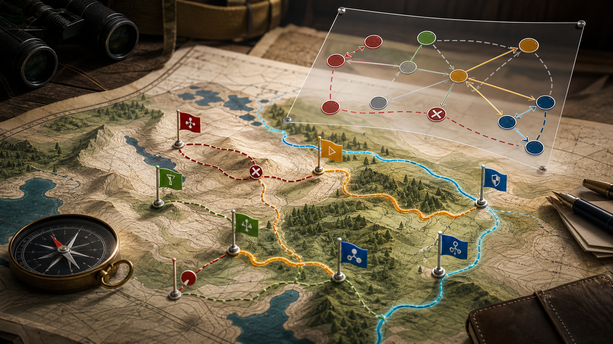
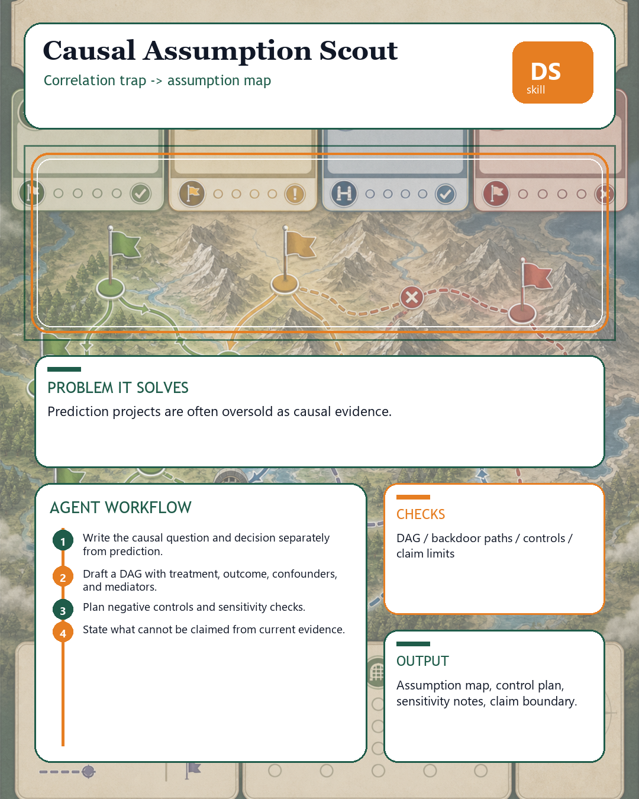

# Causal Assumption Scout





## Executive Summary

`causal-assumption-scout` is a portable, independent data-science agent skill for: Clarify when a data science request needs causal reasoning, what assumptions are required, and what evidence is missing.

It solves a real operating problem: Teams overclaim causal impact from observational models, dashboards, or correlations. Causal claims need explicit estimand, intervention, confounders, assumptions, and sensitivity checks.

The design target is the level expected by senior data scientists, staff ML engineers, and governance reviewers: explicit evidence, reproducible checks, decision-grade output, clear owner questions, and enough structure for another agent to run the same workflow without hidden context.

## Research-Informed Design Standard

This skill was redesigned against patterns from high-quality public data-science and agent-skill repositories:

- Cookiecutter Data Science: predictable folders, immutable raw evidence, project docs, tests, and dependency discipline.
- Kedro: modular, reproducible, maintainable pipeline thinking.
- MLflow: lifecycle tracking, evaluations, registry/deployment awareness, and broad integration posture.
- Anthropic-style skills: portable folder with `SKILL.md`, scripts, references, and resources.
- Reproducible-research guidance: documentation, dependency management, version control, testing, collaboration, and transparency.

## Problem It Solves

Clarify when a data science request needs causal reasoning, what assumptions are required, and what evidence is missing.

- Primary pain: Teams overclaim causal impact from observational models, dashboards, or correlations.
- Why generic tools are not enough: generic notebooks, profilers, dashboards, and MLOps tools inspect pieces of the problem; this skill forces the agent to connect evidence, assumptions, owner decisions, risk, and next action.
- What the skill adds: Causal claims need explicit estimand, intervention, confounders, assumptions, and sensitivity checks.

## What This Skill Should Do

- Transform a vague request into an explicit Causal Assumption Scout decision with named owner, evidence, assumptions, and action threshold.
- Inspect local artifacts first: data extracts, schemas, notebooks, SQL, pipeline configs, model reports, tickets, and prior decisions.
- Separate mechanical checks from expert judgment so another reviewer can reproduce what was checked and what was inferred.
- Classify findings as stop, fix-first, monitor, accepted risk, or owner decision instead of producing generic advice.
- Preserve raw evidence and never silently mutate data, notebooks, model artifacts, or production configs.
- Return a decision artifact that can be handed to a data scientist, ML engineer, governance reviewer, or stakeholder without hidden context.

## Required Inputs

- proposed claim
- treatment or intervention
- outcome
- population
- available covariates
- study design

If an input is missing, the agent should inspect local files, schemas, notebooks, SQL, configs, reports, tickets, model artifacts, or metadata first. It should ask the user only when missing context would materially change the decision.

## Operating Workflow

1. Rewrite the claim as prediction, association, or causal effect.
2. Define treatment, outcome, population, time window, and estimand.
3. Draft a DAG-level assumption map and confounder inventory.
4. Recommend experiment, quasi-experiment, matching, weighting, regression, or do-not-claim-causality.
5. Return language that is safe for stakeholders and a sensitivity plan.

## Expected Outputs

- causal claim rewrite
- assumption map
- confounder checklist
- method recommendation
- safe-language memo

Every final answer should include:

- `Problem`
- `Inputs`
- `Checks performed`
- `Findings`
- `Decision`
- `Risks`
- `Next actions`
- `Artifacts`

## Concrete Use Cases

- Project intake: decide whether to proceed, fix prerequisites, or stop before time is wasted.
- Review gate: challenge a result when evidence is weak, assumptions are hidden, or a red flag appears.
- Handoff: create an artifact an engineer, analyst, governance reviewer, or another agent can continue from.
- Incident prevention: catch the workflow failure before it becomes a bad model, broken dashboard, or misleading executive claim.

## Red Flags

- no intervention
- post-treatment controls
- selection bias
- unmeasured confounders
- effect framed after seeing results

When one appears, the agent must surface it, classify its severity, and tie it to a next action or owner decision.

## Agent And Provider Portability

This skill is designed for OpenAI Codex, ChatGPT Agents, Anthropic Claude, Claude Code, Google Gemini, GitHub Copilot, Cursor, Windsurf, Goose, OpenCode, OpenHands, Gravity, LangGraph, CrewAI, AutoGen, LlamaIndex, Semantic Kernel, and local LLM agents.

Use `SKILL.md` as the primary instruction. Use `references/agent-portability.md` for provider-specific adaptation and `MANIFEST.json` for machine-readable package expectations.

## Data Platforms

Use exported metadata, schemas, samples, logs, lineage files, model cards, metric reports, experiment records, or incident notes from Snowflake, BigQuery, Databricks, Postgres, dbt, Dagster, MLflow, DVC, W&B, SageMaker, Vertex AI, Azure ML, local files, or equivalent systems.

Provider output is evidence, not authority. Do not upload private data to external services unless the user explicitly approves that environment.

## Included Files

- `SKILL.md`: trigger metadata and core execution workflow.
- `README.md`: this independent GitHub skill page.
- `MANIFEST.json`: machine-readable contract for portability checks.
- `AGENTS.md`: local agent instructions for editing or validating this skill folder.
- `agents/openai.yaml`: OpenAI-facing metadata and invocation defaults.
- `references/playbook.md`: operational checklist and failure modes.
- `references/acceptance-tests.md`: clean, messy, and adversarial forward tests.
- `references/provider-interop.md`: provider and data-platform guidance.
- `references/agent-portability.md`: Codex, Claude, Gemini, Copilot, Cursor, Windsurf, Gravity, and multi-agent adaptation.
- `references/quality-rubric.md`: senior-review scoring rubric.
- `references/benchmark-plan.md`: expanded test plan.
- `references/research-grounding.md`: source-informed design rationale.
- `tests/test_skill_contract.py`: portable stdlib contract tests.
- `tests/fixtures/`: clean, messy, and adversarial prompt fixtures.
- `scripts/`: deterministic helper scripts where useful.
- `assets/hero-shot.png`: 1600x900 hero image.
- `assets/reddit-infographic.png`: 1080x1350 Reddit-ready infographic.

## Validation

Run these from inside the skill folder:

```bash
python scripts/quick_validate_skill.py . --strict
python tests/test_skill_contract.py .
```

Then run at least one clean, messy, and adversarial forward test from `tests/fixtures/`.

## GitHub PR Visual Links

- Hero shot: https://raw.githubusercontent.com/Emily2040/data-science-agent-skills/add-data-science-skill-causal-assumption-scout/data-science-agent-skills/causal-assumption-scout/assets/hero-shot.png
- Reddit infographic: https://raw.githubusercontent.com/Emily2040/data-science-agent-skills/add-data-science-skill-causal-assumption-scout/data-science-agent-skills/causal-assumption-scout/assets/reddit-infographic.png
