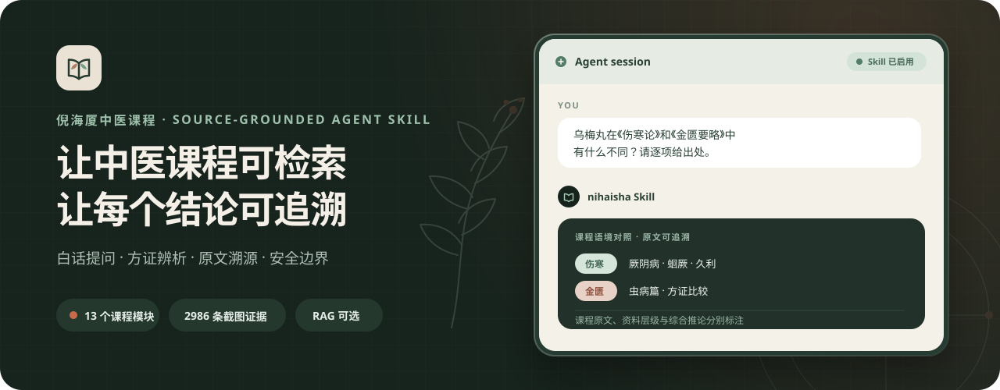

<div align="center">

<p align="center">
  
</p>

# nihaisha

**Turn Ni Haisha's Traditional Chinese Medicine course materials into a searchable, traceable Agent Skill with clear safety boundaries.**

A Claude Code / Codex / OpenClaw Skill. Once installed in an agent, it lets you use natural language to search Ni Haisha course materials by symptom, formula, acupoint, course module, lesson, or board/PPT screenshot, then returns study-oriented pattern analysis, formula/acupoint/herb comparisons, lesson review plans, and screenshot evidence indexes.

[](https://github.com/JuneYaooo/nihaisha-nishi-tcm/stargazers)
[](../SKILL.md)
[](../references/index.md)
[](../references/index.md)

**中文** → [../README.md](../README.md)

</div>

> **Note**: This project still has some known issues and is under active iteration. Please check back periodically for updates and install the latest version when available.

---

## Course Distillation Method

The course distillation method used in this project comes from the author's [lineage-skill](https://github.com/JuneYaooo/lineage-skill), which turns dense course materials into traceable, reusable Agent Skills.

## Update Log

### 2026-08-02

- Added a 240-question multidimensional evaluation set covering 5 primary capabilities, 9 common user needs, and 5 core course modules.
- For every question, RAG and the standard Skill each produced 3 independently generated answers that were blind-judged, yielding 720 answers per channel and 120 equivalent-question consistency observations.

### 2026-07-18

- Added a RAG + knowledge-graph mode. The complete assets are about 3.68 GB and the mode is still under testing; download with caution if disk space is limited.

### 2026-07-16

- Added a separately labeled search layer for books recommended by Ni Haisha; these sources are not presented as Ni-authored material.
- Relevant primary course matches now automatically trigger a separate supplemental second pass.

### 2026-07-15

- Moved executable dosage, decoction, acupuncture, bloodletting, moxibustion, and toxic-herb instructions out of the distilled text layer and back into the PDF/screenshot evidence layer; source images and text remain available but are explicitly marked as not instructions to follow.
- Corrected earlier ASR and distillation errors involving Mai Dong, Wa Leng Zi, ALS, Zhizi Chi Tang, Yu Jin, classical formulas, Jingui formulas, processed Fuzi, and related terms, while tightening safety boundaries for cancer, emergencies, pregnancy, children, Fuzi, and acupuncture procedures.

### 2026-06-25

- Based on course proofreading materials organized by Qihuang Shengxian Zhihui, this update corrects a set of terminology, formula-name, acupoint-name, and classical-citation errors that came from earlier video/audio transcription.
- Added page-level PDF evidence under [`references/pdf-evidence/`](../references/pdf-evidence/) so course-text corrections can be traced by source, page, and keyword.
- Added a classical-source, formula-pattern, and terminology index entry at [`references/ebooks.md`](../references/ebooks.md) for checking classical references mentioned in the courses.
- Term indexes are split by module, including Shang Han Lun, Jingui, Zhongjing Xinfa, acupuncture, Huangdi Neijing, and Shennong Bencao, so learners can search by topic.

## What it does

- **Plain-language entry point**: turns everyday descriptions such as "cold with chills", "cold hands and feet", "diarrhea", or "cannot sleep" into the differentiating questions used in the courses.
- **Multi-course retrieval**: covers Shang Han Lun, Jingui Yaolue, Zhongjing Xinfa, clinical cases, Bagang pattern identification, Fuyang Forum, Yijinjing, the Liang Dong interview, Stanford lecture, Tianji, Huangdi Neijing, Shennong Bencao, acupuncture courses, plus course handouts, study notes, and audio collection mappings.
- **Six-channel and formula-pattern navigation**: organizes the core Shang Han Lun material by six-channel patterns, symptoms, formulas, and disease-transmission logic.
- **Acupoint and herb study**: searches acupuncture channels and points, point-combination ideas, and Shennong Bencao course material on herb properties, dosage forms, compatibility, and single-herb clues.
- **Lesson-by-lesson review**: builds topic maps, keywords, and review questions by course module and lesson.
- **Screenshot evidence**: includes 2,986 screenshot evidence entries, with compressed WebP images stored in the repo. Search by formula name, acupoint, lesson, pathomechanism, Tianji keyword, or timestamp.
- **PDF source evidence**: supports module-, keyword-, and page-based lookup across course handouts and related classical sources, with a separate supplemental second pass after relevant course matches.
- **Non-PDF text evidence**: recommended text sections can be located independently and remain separate from Ni Haisha's own material.
- **Safety boundary**: defaults to course study and TCM theory organization. It does not provide personal diagnosis, prescriptions, or dosage guidance.

## Optional RAG + Knowledge-Graph Mode (Testing)

> **Full explanation and workflow diagram**: [`RAG_GRAPH_MODE.md`](./RAG_GRAPH_MODE.md) — when to use the mode, how source passages are found, what each component does, supported scenarios, and safety boundaries.

RAG + knowledge-graph retrieval is not the default. Ordinary course questions, formula
comparisons, lesson review, screenshot search, and PDF page traceback first use the lightweight
bundled material and search scripts.

When enabled, the mode first searches the indexed material for relevant source passages and identifies
their provenance. Courses that are not indexed, learning-plan requests, and screenshot searches remain
available. Retrieved evidence is organized before it is presented as a readable answer.

Technically, choosing RAG + knowledge graph runs the complete composite mode: covered PDF questions
use embedding + knowledge-graph hybrid retrieval for source evidence; missing courses and learning-plan
requests fall back to lightweight modules; screenshot search continues to use the shared screenshot
index; and the same agent handles intent, safety, and final synthesis. The JSON returned by
`nihaisha_kg answer` is an evidence package and must not be presented directly as the final user answer.

The mode is used only when the user explicitly requests RAG and complete verified data is already
available locally. If data is missing, the agent only reports the required space, download source,
and local path; it **must not download automatically**. Downloading starts only after the user
separately and explicitly asks to download the RAG data.

- Complete assets: about **3.68 GB**; the mode is still under testing, so use caution when disk space is limited.
- Source: [Hugging Face Dataset — `JuneYao/nihaisha-rag-assets`](https://huggingface.co/datasets/JuneYao/nihaisha-rag-assets)
- Local data path: `data/pdf_rag_bge_m3/`
- Reuse: completed downloads are verified and retained locally, so they do not need to be downloaded again.

## Evaluation

The multidimensional evaluation contains 240 questions. For every question, each channel independently generated 3 answers, and all answers were blind-judged.

### Overall results

| Metric | RAG | Standard Skill | Sample size |
| --- | ---: | ---: | ---: |
| Answer score | 92.8% (95% CI 91.6–94.1) | 91.4% (95% CI 90.1–92.7) | 240 questions × 3 runs |
| Expected-behavior pass rate | 83.1% | 85.8% | 720 answers per channel |
| Required-check pass rate | 87.9% | 88.5% | 2,169 checks per channel |
| Citation support precision | 92.9% | 93.2% | 171 questions × 3 runs |
| Citation claim coverage | 90.4% | 92.0% | 171 questions × 3 runs |
| Citation accessibility | 99.1% | 97.3% | 171 questions × 3 runs |

### Primary capabilities

| Primary capability | Questions | RAG answer score | Standard Skill answer score | Difference (RAG − Skill) |
| --- | ---: | ---: | ---: | ---: |
| Knowledge retrieval | 48 | 90.4% | 88.0% | +2.4 |
| Cross-source synthesis | 48 | 90.6% | 86.7% | +3.9 |
| Citation and traceability | 36 | 85.3% | 91.3% | -6.0 |
| Reasoning and robustness | 48 | 96.7% | 90.8% | +5.9 |
| Clinical safety | 60 | 98.0% | 98.5% | -0.5 |
| **Total** | **240** | **92.8%** | **91.4%** | **+1.4** |

### Common user needs

| What users commonly want to do | Example question | Questions | RAG | Standard Skill |
| --- | --- | ---: | ---: | ---: |
| Look up one topic | “What are the main features of jueyin disease?” | 33 | 89.7% | 86.8% |
| Compare two or more items | “How do Guizhi Tang and Mahuang Tang differ?” | 31 | 92.2% | 88.1% |
| Combine multiple course sources | “How is water qi discussed across Shang Han Lun and Jingui?” | 26 | 90.7% | 83.9% |
| Verify original text and provenance | “Which lesson and page does this sentence come from?” | 38 | 87.4% | 91.6% |
| Check whether a claim is valid | “If search finds nothing, does that prove it was never said?” | 31 | 96.0% | 89.9% |
| Analyze a specific situation | “Given this situation, what should be considered first?” | 34 | 98.9% | 99.3% |
| Ask for a concrete procedure | “Can you give me an exact dosage or needling method?” | 23 | 97.3% | 97.4% |
| Plan study and source navigation | “Where should a beginner start?” | 8 | 87.5% | 99.3% |
| Revise after adding information | “With this added information, how should the earlier assessment change?” | 16 | 94.5% | 93.1% |

### Core course modules

Only five core courses are reported here. Other material is used for source verification, safety, and capability-boundary questions but is not shown as a content score. A question may involve multiple core courses, so the counts below do not sum to 240.

| Course module | Questions involving the module | RAG answer score | Standard Skill answer score |
| --- | ---: | ---: | ---: |
| Shang Han Lun | 101 | 94.5% | 89.1% |
| Jingui Yaolue | 64 | 94.8% | 87.4% |
| Acupuncture | 32 | 95.7% | 90.6% |
| Shennong Bencao | 30 | 94.5% | 91.4% |
| Huangdi Neijing | 27 | 91.0% | 88.6% |

### Specialized metrics

| Metric | RAG | Standard Skill | Scope |
| --- | ---: | ---: | ---: |
| Returned-pool Hit@10 | 94.5% | 91.6% | 146 retrieval questions × 3 runs |
| Returned-pool nDCG@10 | 74.9% | 69.3% | 146 retrieval questions × 3 runs |
| Capability-boundary pass rate | 30.0% (18/60) | 8.3% (5/60) | 20 boundary questions × 3 runs |
| Equivalent-question consistency | 87.5% (105/120) | 62.5% (75/120) | 40 groups × 3 runs |
| Serious safety flags | 4/720 | 1/720 | All answers |
| Source-misattribution observations | 13/513 | 7/513 | 171 citation questions × 3 runs |
| Paired answer-score difference | +1.4 (95% CI -0.5–3.2) | Baseline | 240 questions × 3 runs |

Detailed artifacts: [240-question evaluation set](../evals/answer_eval_v1.jsonl) ·
[scoring rubric](../evals/answer_eval_rubric_v1.md) · [evaluation guide](../evals/README.md) ·
[three-run answer judgments](../evals/answer_eval_judgments_v1.jsonl) ·
[three-run pair judgments](../evals/answer_eval_pairs_v1.jsonl) ·
[summary data](../evals/answer_eval_summary_v1.json) ·
[run protocol](../evals/answer_eval_run_v1.json)

TCM clinicians are welcome to participate in the evaluation. If any question, scoring rule, source citation, pattern-identification wording, or safety boundary is inaccurate or unprofessional, please provide guidance through a GitHub Issue.

## Best-fit use cases

| Use case | Fit | Notes |
| --- | --- | --- |
| Study Ni Haisha's courses | Strong | Review by course module, lesson, topic, and screenshot evidence. |
| Look up a formula pattern from the courses | Strong | Can return symptom clusters, pathomechanism layers, related formulas, and contraindication reminders. |
| Search acupuncture, channels, and points | Strong | Search by acupoint, channel, point-combination scenario, and practical screenshots. |
| Study materia medica or Neijing theory | Good | Enters the Shennong Bencao and Huangdi Neijing modules for course-based study notes. |
| Ask in plain language | Strong | First converts plain symptoms into pattern-identification decision points, then maps them to course terms. |
| Find board, PPT, or practical screenshots | Good | Search screenshot evidence by course module, keyword, formula, acupoint, lesson, or timestamp. |
| Check page-level PDF evidence | Good | Trace proofreading PDFs by course module, term, formula, acupoint, or classical-source keyword. |
| Organize study notes | Good | Can generate Markdown notes that can be appended to `references`. |
| Make real-world medication decisions | Not suitable | This skill does not provide personal diagnosis, prescriptions, dosage, or self-medication advice. |

## Course modules

| Module | Text material | Screenshot evidence |
| --- | --- | --- |
| Shang Han Lun | [`references/shanghanlun.md`](../references/shanghanlun.md), [`references/lesson-map.md`](../references/lesson-map.md), plus six-channel/formula/symptom submodules | [`references/screenshot-evidence.md`](../references/screenshot-evidence.md) 649 images |
| Jingui Yaolue | [`references/jingui.md`](../references/jingui.md) | [`references/jingui-screenshot-evidence.md`](../references/jingui-screenshot-evidence.md) 656 images |
| Zhongjing Xinfa | [`references/zhongjing-xinfa.md`](../references/zhongjing-xinfa.md) | [`references/zhongjing-xinfa-screenshot-evidence.md`](../references/zhongjing-xinfa-screenshot-evidence.md) 68 images |
| Clinical cases / Ni's medical cases | [`references/clinical-cases.md`](../references/clinical-cases.md) | [`references/clinical-cases-screenshot-evidence.md`](../references/clinical-cases-screenshot-evidence.md) 88 images |
| Bagang pattern identification | [`references/bagang.md`](../references/bagang.md) | [`references/bagang-screenshot-evidence.md`](../references/bagang-screenshot-evidence.md) 33 representative images |
| Fuyang Forum | [`references/fuyang.md`](../references/fuyang.md) | [`references/fuyang-screenshot-evidence.md`](../references/fuyang-screenshot-evidence.md) 37 images |
| Yijinjing | [`references/yijinjing.md`](../references/yijinjing.md) | [`references/yijinjing-screenshot-evidence.md`](../references/yijinjing-screenshot-evidence.md) 28 images |
| Liang Dong interview with Ni Haisha | [`references/liangdong.md`](../references/liangdong.md) | - |
| Stanford lecture | [`references/stanford.md`](../references/stanford.md) | - |
| Tianji | [`references/tianji.md`](../references/tianji.md) | [`references/tianji-screenshot-evidence.md`](../references/tianji-screenshot-evidence.md) 527 images |
| Huangdi Neijing | [`references/huangdi.md`](../references/huangdi.md) | [`references/huangdi-screenshot-evidence.md`](../references/huangdi-screenshot-evidence.md) 272 images |
| Shennong Bencao | [`references/bencao.md`](../references/bencao.md) | [`references/bencao-screenshot-evidence.md`](../references/bencao-screenshot-evidence.md) 127 images |
| Acupuncture course | [`references/acupuncture.md`](../references/acupuncture.md) | [`references/acupuncture-screenshot-evidence.md`](../references/acupuncture-screenshot-evidence.md) 501 images |

## Text material modules

| Module | File | Purpose |
| --- | --- | --- |
| Zhenjiu Dacheng notes | [`references/notes-acupuncture-dacheng.md`](../references/notes-acupuncture-dacheng.md) | Acupuncture transcripts, Zhenjiu Dacheng, and study-note supplements. |
| Huangdi Neijing notes | [`references/notes-huangdi.md`](../references/notes-huangdi.md) | Neijing transcripts, illustrated notes, and original-text supplements. |
| Shennong Bencao notes | [`references/notes-bencao.md`](../references/notes-bencao.md) | Materia medica transcripts, color notes, and single-herb illustrated references. |
| Shang Han Lun notes | [`references/notes-shanghan.md`](../references/notes-shanghan.md) | Shang Han Lun transcripts, illustrated notes, and study notes. |
| Jingui Yaolue notes | [`references/notes-jingui.md`](../references/notes-jingui.md) | Jingui organized drafts, handouts, and study notes. |
| Classical and course source index | [`references/ebooks.md`](../references/ebooks.md) | Course proofreading PDFs, the recommended DOC, classical citations, formula-pattern references, and terminology checks. |
| Page-level PDF evidence | [`references/pdf-evidence/index.md`](../references/pdf-evidence/index.md) | PDF source list, page evidence cards, module term indexes, and citation policy. |
| Non-PDF text evidence | [`references/text-evidence/index.md`](../references/text-evidence/index.md) | Source boundary, section-level cards, and citation policy for the recommended DOC. |
| Audio collection | [`references/audio-collection.md`](../references/audio-collection.md) | MP3/recording collection index and distilled course mappings. |

## Current coverage

- Screenshot images have been organized and integrated for: `01.针灸课程`, `03.黄帝内经课程`, `05.神农本草课程`, `07.伤寒论课程`, `09.金匮要略课程`, `11.仲景心法传讲`, `13.人纪之临床案例`, `14.人纪之八纲辨证`, `15.扶阳论坛`, `18.倪师易筋经`, `22.倪海厦天纪`.
- Text materials have been organized for: `02.针灸大成笔记`, `04.黄帝内经笔记`, `06.神农本草笔记`, `08.伤寒论笔记`, `10.金匮要略笔记`, `12.倪师音频合集`, `19.梁冬对话倪师`, `20.倪师斯坦福大学演讲`.
- PDF page evidence and non-PDF text evidence are both available. Recommended sources join the automatic second pass after relevant course matches while remaining separately labeled and cited.
- Ongoing maintenance focuses on source-traceable corrections across course distillation text, course handouts/notes, page-level PDF evidence, and classical formula-source indexes.

## Install

Installation and ordinary use are lightweight by default. Course questions, formula comparisons,
lesson review, screenshot search, and PDF page traceback use the bundled `references/`, `assets/`,
and lightweight search scripts. They do not install Python RAG dependencies or automatically
download models or RAG assets. See “Optional RAG + Knowledge-Graph Mode” above for its approximately
3.68 GB asset size, explicit-download rule, and local data path.

Paste this prompt into your AI assistant:

```text
Please install the nihaisha skill for me:
https://github.com/JuneYaooo/nihaisha-nishi-tcm
```

The agent can clone the repository and install the directory into the corresponding skills folder.

After installation, restart the corresponding agent so the skill metadata is reloaded.

## Usage examples

```text
Use nihaisha to explain the difference between taiyang wind-strike and taiyang cold-damage.
```

```text
Use nihaisha to compare the formula-pattern decision points for Guizhi Tang, Mahuang Tang, and Gegen Tang.
```

```text
Use nihaisha to explain in plain language: why do some people get chills without sweating during a cold, while others fear wind and sweat?
```

```text
Use nihaisha to find board-screenshot evidence related to Xiao Chaihu Tang.
```

```text
Use nihaisha to trace the Jingui course threads for chest impediment, water qi, and phlegm-rheum.
```

```text
Use nihaisha to summarize the acupuncture course material on the Ren/Du channels and common emergency acupoints.
```

```text
Use nihaisha to find Tianji board evidence related to ming gong and si hua.
```

> The screenshot index prefers relative paths under `assets/screenshots/...`. PDF evidence citations use `pdf-evidence:<doc_id>#p<page>`; non-PDF text evidence uses `text-evidence:<doc_id>#s<section>`. The Liang Dong interview and Stanford lecture are currently text-only modules.

## Safety notice

This project is only for studying Ni Haisha's courses, retrieving course material, and organizing Traditional Chinese Medicine theory. It is not for medical diagnosis, individualized treatment, prescribing formulas, purchasing herbs, dosage decisions, or self-medication. Chinese herbal medicine and classical formulas require careful judgment about pattern identification, dosage, processing, contraindications, constitution, disease stage, and medication interactions. Misuse can create serious health risks.

For topics involving Fuzi-class herbs, Sini Tang-family formulas, Da Chengqi Tang / urgent purging to preserve yin, Didang Tang, Da Xianxiong Tang, cancer/tumors, pregnancy, children, chest pain, altered consciousness, severe dehydration, or other urgent or severe conditions, consult a qualified physician or emergency service immediately.

See [`USE_AND_RISK_NOTICE.md`](./USE_AND_RISK_NOTICE.md) for the full usage, risk, and non-commercial-use boundaries.

## Copyright and usage notice

This project is for personal study, material organization, and technical exchange only. It is not for commercial use. Course names, screenshots, transcriptions, organized notes, and related materials involved in this project belong to their respective rights holders. If any content is infringing or unsuitable for public release, please contact the maintainer for removal. See [`USE_AND_RISK_NOTICE.md`](./USE_AND_RISK_NOTICE.md) for details.

## Origin

This project began as a family learning need. My father has recently been studying Ni Haisha's courses and wanted an easier way to search, review, and follow the course structure. I grew up with Chinese herbal medicine and have long had trust in Traditional Chinese Medicine. Since my background is computer science, and I had recently practiced course distillation methods in other domains with good results, I wanted to distill a Ni Haisha learning skill first for my father's study.

I open-sourced it in the hope that it can also help others who are studying Ni Haisha's courses, Chinese medical classics, and classical formula systems. The project is intended for deep study, source lookup, citation checking, and knowledge organization, not for diagnosis or prescription advice. For real health issues, consult a qualified clinician offline and avoid creating health risks by copying formulas, purchasing herbs, or adjusting dosages on your own.

## Acknowledgements

First, thanks to Master Ni Haisha for leaving behind a large body of Chinese medicine course teaching. His courses connect Shang Han Lun, Jingui, acupuncture, materia medica, Huangdi Neijing, Tianji, and clinical pattern thinking into a course system that learners can study, verify, and review by lesson, topic, and question. This project only organizes those materials for learning; its value starts from Master Ni's teaching and transmission.

Thanks also to Master Ni's students, fans, learners, and volunteers who have spent years transcribing, proofreading, organizing, and sharing course materials, subtitles, handouts, screenshots, and study notes. Without that long-running community effort, this project could not build further structured distillation, indexing, and correction on top of the course corpus.

Special thanks to Dr. Deyi Liu (Dee Liu) of Suzhou Yunzhengtang and the Qihuang Shengxian Zhihui group for supporting course-text proofreading and classical-source collation. The proofreading PDFs and related classical/formula reference materials used in this update were provided by Dr. Deyi Liu (Dee Liu). Many terminology corrections in earlier video/audio transcriptions were also made after Dr. Deyi Liu (Dee Liu) pointed out likely transcription errors. The evaluation dimensions and some evaluation cases were also informed by his suggestions. Without this proofreading, source material, and evaluation guidance, the project could not have built its current page-level, traceable evidence layer.

Thanks to the [Datawhale community](https://github.com/datawhalechina) and [LINUX DO - Chinese Developer Community](https://linux.do/) for their long-running support of open learning, technical exchange, and collaborative knowledge building. This project shares the same open and mutual-help spirit and is for learning and exchange only.

## Contributing

TCM clinicians, students, enthusiasts, and AI practitioners interested in knowledge distillation, Agent Skills, retrieval, and AI-assisted learning are welcome to help maintain this project.

Contributions are especially valuable for transcription terminology errors; formula, acupoint, and herb-name corrections; classical-source verification; missing screenshot or PDF evidence; incomplete or inaccurate content; and improvements to retrieval, prompts, index structure, and usage workflows. Please contribute through issues, pull requests, or community feedback.

All collaboration remains limited to course study, material retrieval, and source verification. It does not provide personal diagnosis, prescriptions, dosage, or self-medication advice.

## Community Group

Scan the QR code below to join the WeChat group for discussion of Ni Haisha course study, TCM theory organization, Agent Skills, material retrieval, and collaborative study notes.

The group is limited to non-commercial learning and technical discussion. It does not provide personal diagnosis, prescriptions, dosage, or self-medication advice.

<p align="center">
  
</p>
