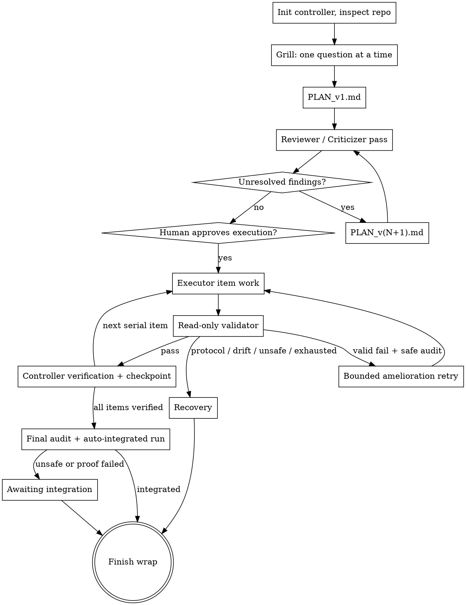

# Optim Plans

Plan before execution. The bundled controller keeps durable state under the Git common directory and public Markdown under `docs/optim-plans/YYYY-MM-DD-topic/`.

This flow fixes two failure modes in order: grilling the user fixes building the *wrong thing*; adversarial reviewer/criticizer passes fix a plan that *sounds right but breaks*.

QA work is not a rubber stamp: during brainstorming and criticizing, actively hunt applicable edge cases before the plan can sound settled.
<HARD-GATE>
Do NOT write code, scaffold files, edit repo docs/config, or change target files until the plan has passed refinement or the human selects `Jump to executor`, and the controller has recorded immutable execution-manifest approval. Before execution approval, the only permitted writes are controller state and `docs/optim-plans/YYYY-MM-DD-topic/` artifacts. Auto-complete can answer planning questions; Auto-complete never approves execution, and execution approval questions must not offer `Auto-complete`. The `Jump to executor` / `skip-refinement-execute` human choice is direct execution approval through the controller.
</HARD-GATE>

## First Turn Contract

Treat the user's prompt as a planning target, not write authorization. After any read-only context check, the first visible response must be one optim-plans choice question, not a completed analysis or file edit. It must include recommended first, `Other` second-last, and `Auto-complete` last. References inform the recommended option; they never replace the user interview. One human-choice answer is necessary but not sufficient: after the answer, continue through `PLAN_v1.md`, refinement, and explicit execution approval before editing target files.

## Language Policy

Persist language in the target repo's `.git/optim-plans/config.json` top-level `language` field as a normalized BCP47-style string. Run controller `init` with the original request in `--request-text`; it is stored in `run.json`. If `config.language` is missing or invalid, the first visible response is the controller's `language-selection` question, and every later controller-backed question surface must return that unanswered question until it is answered.

The `language-selection` option IDs and order are stable: `zh-hans`, `en`, `zh-hant`, `other`, `auto`. The `zh-hans`, `en`, and `zh-hant` options carry `language_value` metadata (`zh-Hans`, `en`, `zh-Hant`). Recommend Chinese (`zh-hans`) when more than 60% of the user's planning request's natural-language body is non-English Chinese; otherwise recommend English (`en`). Count only natural-language prose for the `> 60%` threshold: ignore command prefixes, option IDs, file paths, and code spans.

Use the selected language for questioning, review summaries, criticizer questions, answer choices, and optim-plans Markdown under `docs/optim-plans/`. Keep stable option IDs, stages, nonces, protocol labels, artifact protocol names, and exact controller-required protocol labels unchanged, but localize visible prompt text, option labels, option descriptions/reasons, and agent-written choice prose when rendering controller-backed questions. Valid unsupported BCP47-style tags fall back to English renderers; only language tags whose primary subtag is exactly `zh` render Chinese. Always write commit messages in English.

## Plan Request Levels

Users may choose the planning depth in the prompt or via direct controller flags:

- `mini-plan`: 1 planning question; zero or one refinement round. The refinement choice may jump directly to executor with `skip-refinement-execute`.
- `small-plan`: 1 to 3 planning questions; exactly one refinement round.
- `plan`: 1 to 5 planning questions; at most three refinement rounds, 600 seconds per reviewer/criticizer pass, and at most three high-priority comments or questions per round.
- `big-plan`: 5 to 10 planning questions; websearch is required for brainstorming, with at most five refinement rounds, 1800 seconds per reviewer/criticizer pass, and at most five high-priority comments or questions per round.
- `huge-plan` / `huge plan`: at least 10 planning questions, no maximum; websearch is required for brainstorming and refinement, with no refinement round or timeout limit and at most five high-priority comments or questions per round.
- `deep-research-plan` / `deep research plan`: `huge-plan` depth plus the `../deep-research-plan/SKILL.md` contract for 3+ downloaded refs, graphify JSON, and per-ref adoption questions.

For `plan`, `big-plan`, `huge-plan`, and `deep-research-plan`, only high-priority comments or criticisms continue refinement; if a round produces none, terminate that round.

If no level is named, auto-select the smallest level that fits the user's prompt and repo evidence before the first planning question. Do not ask the user to choose the level as that question.

After each plan version, ask one refinement mode question: recommend `Reviewer` first, then `Criticizer`, `Jump to executor` (`skip-refinement-execute`), and `Auto-complete`. For `Reviewer` or `Criticizer`, ask the first `agent-choice` follow-up for the detected agent and effort; later `agent-choice` asks default only from the same worker role: `refinement_worker.choice`, `executor_worker.choice`, or `validator_worker.choice`. Delegated workers are same-platform only: Codex must not call Claude, and Claude must not call Codex.

## Anti-Pattern: "Too Small To Plan"

Every request goes through this flow — a config change, a one-function utility, all of them. Small tasks are where unexamined assumptions waste the most work. The plan may be short; skipping the flow may not.

## Process Flow



## Checklist

Create a task for each item and complete them in order:

1. Inspect the target Git repository before asking any product question.
2. Start or resume the controller:

   ```bash
   python3 <plugin-root>/scripts/optim_plans.py init --repo <repo> --topic "<topic>"
   python3 <plugin-root>/scripts/optim_plans.py status --repo <repo>
   ```

3. Grill the user: ask unresolved questions one at a time until none remain.
4. Write `PLAN_v1.md` under `docs/optim-plans/YYYY-MM-DD-topic/`, including the repo evidence and resolved decisions.
5. Run reviewer or criticizer refinement; produce `PLAN_v(N+1).md` until converged.
6. Obtain explicit human approval for the immutable execution manifest, execute serial items through the controller, then let clean final audits auto-record `integrated`; unsafe auto-integration enters `awaiting_integration`.

## Grilling the User

Direct, evidence-based, relentless until answers are real:

- If a question can be answered by exploring the codebase, explore the codebase instead of asking. Never spend a user question on something the repo already answers.
- If the repo can't answer but the web might (library behavior, version constraints, external API semantics, domain facts), websearch first and cite sources. The evidence ladder is: codebase → cited web research → user question.
- Walk each branch of the decision tree, resolving dependent decisions in order. One question per message; if a topic needs more exploration, split it into multiple questions.
- Every user-facing planning question must be a choice prompt: recommended option first with a short reason, alternatives, `Other` second-last, `Auto-complete` last. The refinement mode question is exactly `Reviewer`, `Criticizer`, `Jump to executor`, `Auto-complete`; the first Reviewer/Criticizer follow-up uses `agent-choice`.
- When asking the user to choose refinement mode, recommend `Reviewer` first. If the user selects `Jump to executor`, pass the execution gate directly with `skip-refinement-execute`.
- Challenge vague or hand-waving answers. If an answer contradicts repo evidence, say so and re-ask — never silently accept it.
- Never answer product questions on the user's behalf unless they pick `Auto-complete`. Auto-complete may accept recommended planning and refinement answers; it never approves execution, waivers, merge, push, release, or destructive cleanup.

## Refinement Stance

- You are the final arbiter of every finding: incorporate critiques worth acting on, reject bad ones with a recorded reason. Caving to everything defeats the review; ignoring it defeats the point.
- Justify dispositions with evidence, not vibes. When a finding or plan decision rests on an unsure technical claim, websearch it and cite the source in the finding record or revision ledger before dispositioning.
- Criticizer mode is not reviewer mode: if the criticizer raises a challenge, ask the user that refinement question before writing criticizer comments or the next plan.
- Never fake convergence. A finding stays `unresolved` until genuinely dispositioned — a flagged disagreement beats a false approval.

## Load References

- Read `references/planning.md` when brainstorming or writing `PLAN_v1.md`.
- Read `references/refinement.md` when choosing reviewer vs criticizer, recording comments, or producing the next plan version.
- Read `references/execution.md` before any write-capable launch or verification loop.
- Read `references/artifacts.md` when creating or validating public Markdown and state files.

## Question Bridge

When native cards are available, render the controller's pending question as cards. Otherwise print numbered Markdown. When rendering, follow the Language Policy for visible labels/reasons and surrounding choice prose while preserving option IDs and exact controller-required protocol labels. Submit only the selected option ID and nonce back to the controller. Stale or replayed nonces must be rejected by the controller, not hand-waved by the agent.

## Invariants

- One active run per Git worktree.
- `run.json` is immutable; `events.jsonl` is authoritative.
- Reviewer and criticizer sessions are read-only and fresh.
- Execution requires a clean committed Git base and explicit manifest-bound human launch approval.
- Executor manifests use same-platform delegation. Current Codex executor/validator delegation uses host-multi-agent mode with `assign-item` / `authorize-spawn` / host `spawn_agent` / `register-agent` / host `wait_agent` / `complete-item` or `fail-item` / `advance-item`; batch execution uses `assign-batch` over a continuous ready prefix, `complete-batch`, `advance-batch`, and `retry-batch`, with all-or-nothing validation/checkpointing and bounded session resume fallback. Current Claude executor delegation uses the CLI adapter path: `run-item` launches the `optim-plans-executor` with `--agent` as a foreground standalone subagent, waits synchronously, and reads stdout JSON; it is not Codex-style `wait_agent`, `--bg`, hidden background, host/background mode, or notification/outputFile wait. CLI adapter fallback still requires same-agent smoke argv before immutable recording and runs through adapter argv with `shell=False` in one controller-owned run worktree and branch. `0.1.2` execution manifests also bind a read-only validator worker, validator prompt hash, item check IDs, and compatibility/display validator retry limit before controller verification; ordinary retryable failures continue until success or blocked.
- Validator output is an input to the controller, not the checkpoint authority. Controller verification, path audits, and protected Git metadata audits remain authoritative; worker prose is evidence only.
- Verified items become checkpoint commits in serial DAG order. Retryable failures restore automatically until success or controller `blocked`; manual recovery remains approval-gated.
- All verified items plus clean final audits automatically fast-forward the checked-out destination and record `integrated`; unsafe or failed proof enters `awaiting_integration`. `finish-run` remains a manual recovery command, with `kept` available only as an explicit preservation outcome.
- The trust boundary is repository-integrity detection and integration gating, not host confinement.
- Hooks only inject context and deny unsafe tool calls; they are defense in depth and the controller owns continuation.

## Red Flags — STOP and Return to the Flow

- Implementing anything before the execution gate
- Batching multiple questions into one message
- Asking a planning or refinement question without `Auto-complete` as the last option
- Treating any answer except `skip-refinement-execute` as execution approval
- Launching a worker outside the manifest-bound `prepare-execution` / `start-execution` / `run-item` flow
- Treating hooks, shell parsing, worker self-attestation, or a verifier agent as the authoritative safety boundary
- Editing target files before `PLAN_v1.md` and refinement artifacts exist
- Accepting a vague answer to keep momentum
- Asking the user (or guessing) something a websearch could have answered with sources
- Dispositioning a finding on an unsure technical claim without cited evidence
- Revising from criticizer comments before every criticizer question has a recorded answer
- Answering a product question yourself without `Auto-complete`
- Offering `Auto-complete` on an execution approval question
- Letting Auto-complete touch execution, waivers, merge, push, release, or cleanup
- Hand-waving a stale or replayed nonce instead of letting the controller reject it
